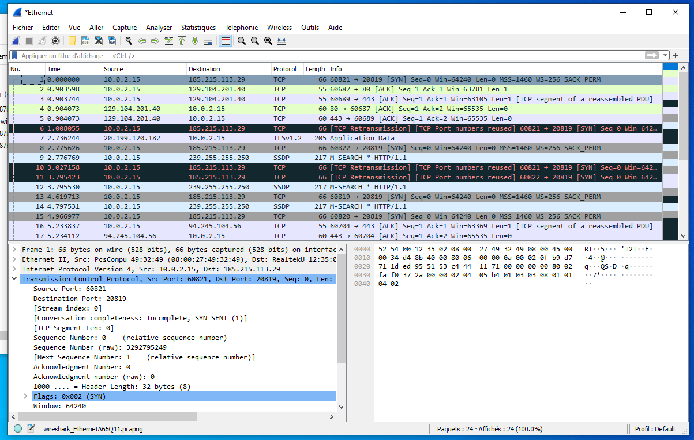
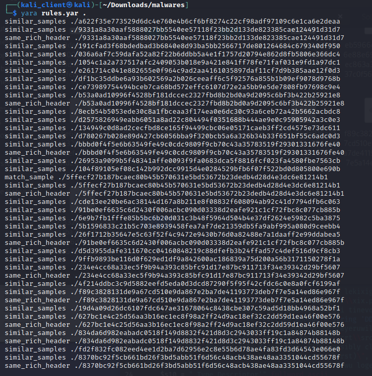

# Short Report - Quentin LAO 

This report was written by Quentin LAO. Additional screenshots can be found in the screenshots folder. Our sample is an .exe file with with a SHA256 of `5ffecf27b187bcaec80b45b570631e5bd53672b23dedb4d28d4e3dc6e81214b1`

## Relevant Elements

We performed Open Source Intelligence (OSINT) and used some tools in Kali Linux to analyse the behaviour of the targeted malware sampple. As a result, the 6 most relevant elements we	found are:

- The malware is Win32 32 bit executable with .exe extension and compatible with intel 386 or later machine types 
- An Indicator Of Compromise is given by MalwareBazaar : The malware tries to connect to 185.215.113.29:20819. I ran the .exe file on a virtual machine and sniffed the traffic (TCP packets) :



- Inside the malware code snippet, there are total 998 functions or strings out of those 32 asre very dangereous and can be categorized as: 8 functions for evasion/bypassing, 1 function for system persistence, and 23 functions for information gathering.
- Based on OSINT, we identified that the malware belongs to the family of Trojan Horse. 
- Community score of this malware is 52/66 i.e. out of 66 antimalware and antivirus vendors marked it as malicious.
- This malware was written in C programming language.

Some other interesting properties of this malware inludes:
- On the basis of MITRE Attack Model, this malware discovers the files and directories and perfrom the time-based evasion. 
- Windows Registry key set mostly disrupted by this malware are:
`--HKLM\SOFTWARE\Microsoft\Windows Media Player NSS\3.0\Servers\105F924A-26DC-488C-B415-6A6327200627\FriendlyName`
`--HKLM\SYSTEM\CurrentControlSet\Services\ASP.NET_4.0.30319\Names`


## Yara Rules

Yara rules attached with this report in the file . We built 3 rules :

* `match_sample` : matches our sample
* `similar_samples` : uses a combination of strings to match specific files. This rule has been written with the support of yarGen. To be tagged as matched, 8 of the strings must be identified. The number of similar samples in `Project_malwares.7z` is 32/176.
* `same_rich_header` : matches with PE file that has the same rich header signature as our sample. The number of samples with the same rich header is 10/176.



## Parser

The parser script is written in `pe_parser.py`. Here is what it prints out :
```
==================IMPORT PE FILE==================
File 'malware.exe' is a PE file


=================CHECK IF IS DDL==================
File 'malware.exe' is not a DLL


================CHECK IF IS SIGNED================
The file is not signed.


==============CHECK IF RICH HEADERS===============
The file has a Rich header :

 Key: aaefdb9e
  - ID: 0x0091 Build ID: 0x521e Count: 1
  - ID: 0x0094 Build ID: 0x521e Count: 1
  - ID: 0x0084 Build ID: 0x521e Count: 65
  - ID: 0x0001 Build ID: 0x0000 Count: 208
  - ID: 0x007b Build ID: 0xc627 Count: 7
  - ID: 0x0083 Build ID: 0x521e Count: 121
  - ID: 0x0095 Build ID: 0x521e Count: 17
  - ID: 0x0096 Build ID: 0x4fbd Count: 1


================EXTRACT TIMESTAMP=================
timestamp: 1627653903 (2021-07-30 15:05:03)


==============CHECK DEBUG DERECTORY===============
Has debug data:
        type: CODEVIEW
        timestamp: 1642414745 (2022-01-17 10:19:05)
```

